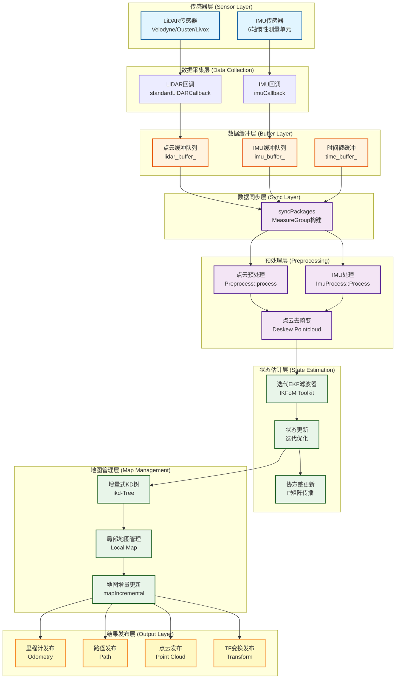
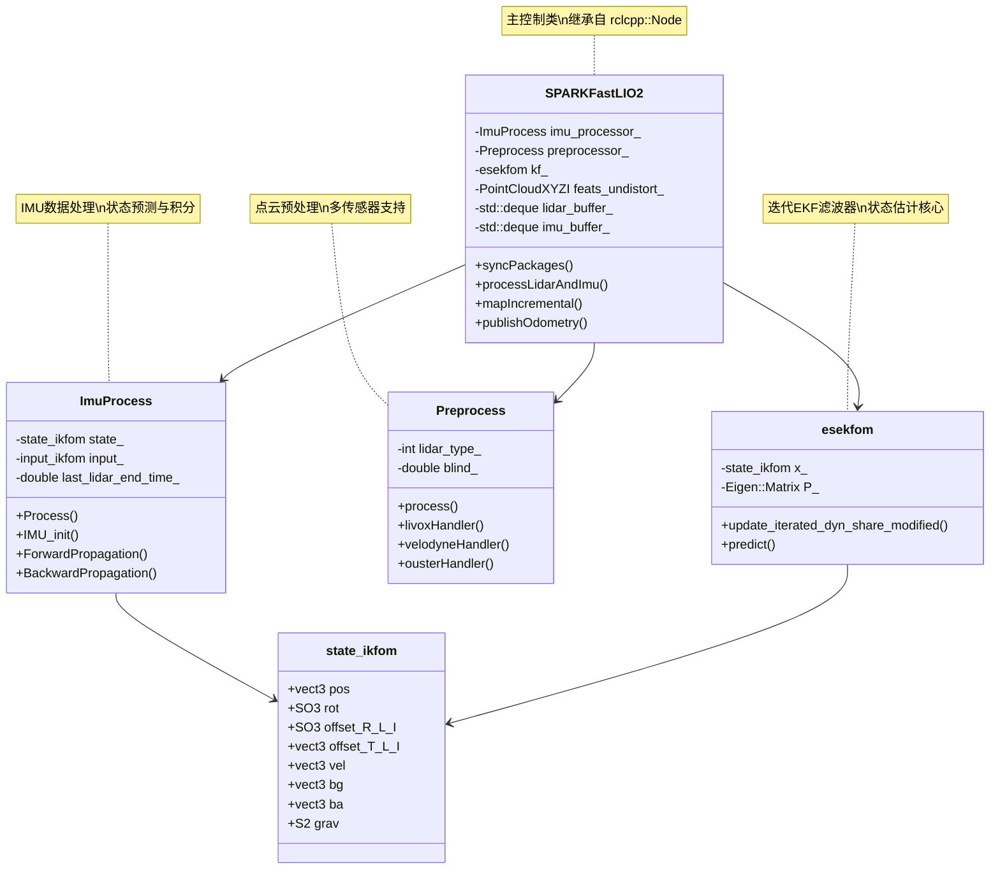
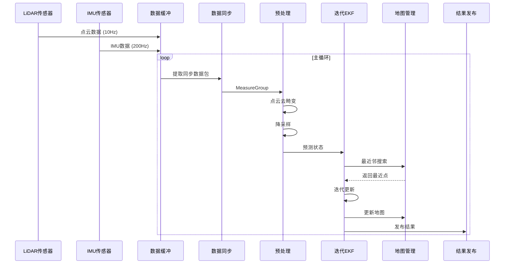
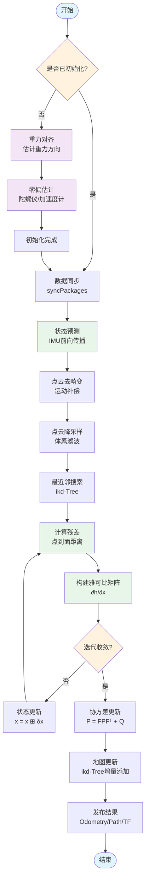
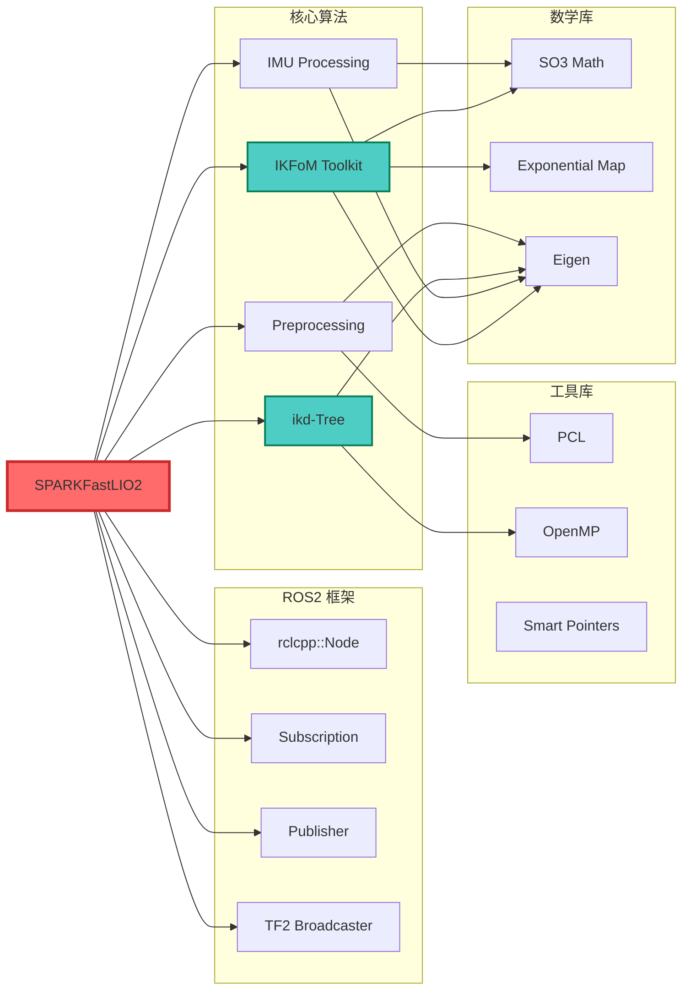
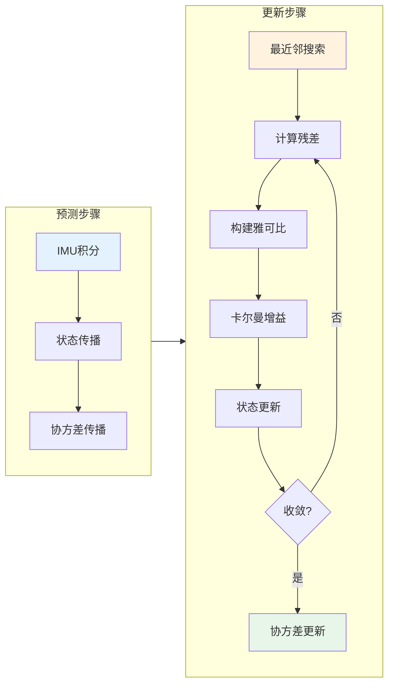
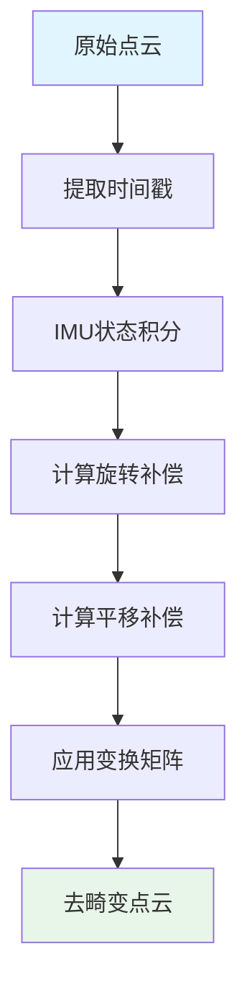
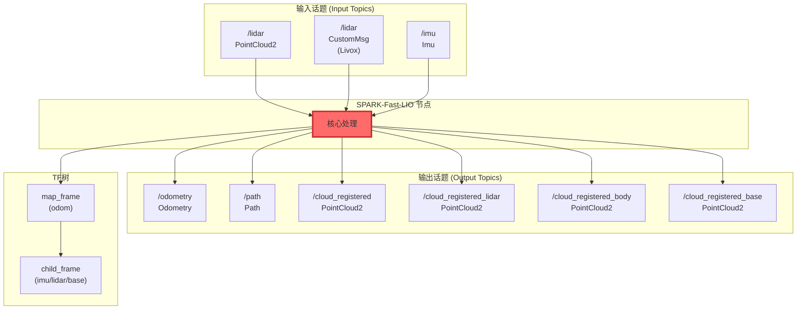
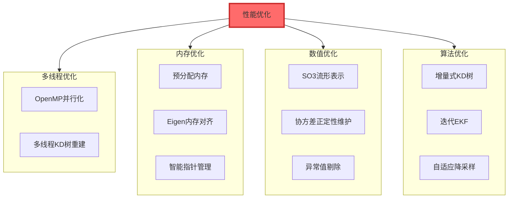
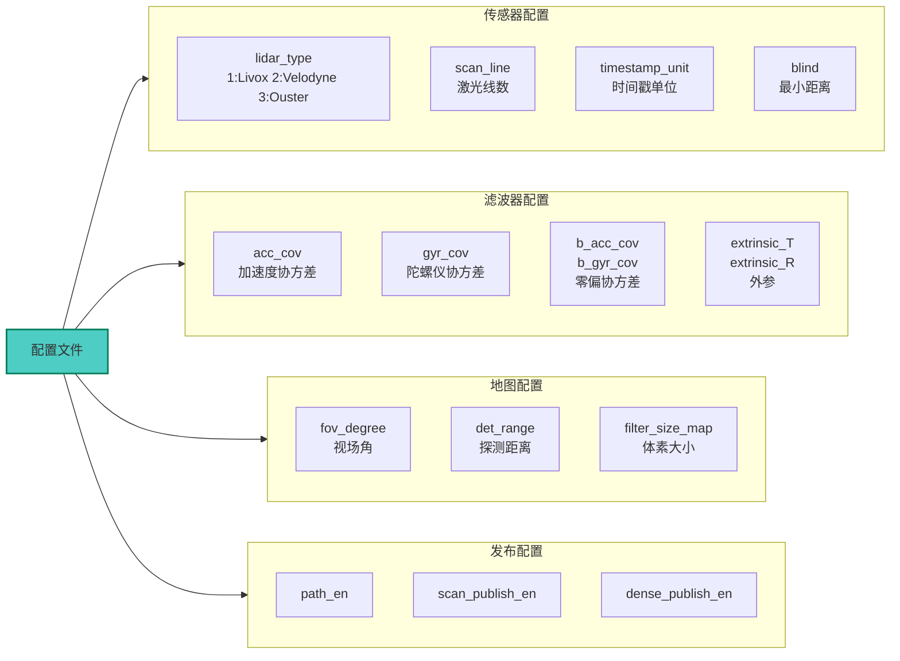

# SPARK-FAST-LIO 系统架构图

## 1. 系统整体架构



## 2. 核心类关系图



## 3. 数据流详细图



## 4. 状态估计流程图



## 5. 模块依赖关系图



## 6. 文件组织结构图

```
spark_fast_lio/
├── src/                              # 源文件
│   ├── spark_fast_lio.cpp            # 主节点实现
│   │   ├── SPARKFastLIO2类           # 主控制类
│   │   ├── standardLiDARCallback()   # LiDAR回调
│   │   ├── imuCallback()             # IMU回调
│   │   ├── syncPackages()            # 数据同步
│   │   ├── processLidarAndImu()      # 主处理循环
│   │   ├── mapIncremental()          # 地图更新
│   │   └── publishOdometry()         # 结果发布
│   │
│   └── preprocess.cpp                # 点云预处理实现
│       ├── livoxHandler()            # Livox处理
│       ├── velodyneHandler()         # Velodyne处理
│       └── ousterHandler()           # Ouster处理
│
├── include/spark_fast_lio/           # 头文件
│   ├── spark_fast_lio.h              # 主类定义
│   ├── imu_processing.hpp            # IMU处理类
│   ├── preprocess.h                  # 预处理接口
│   │
│   └── common/                       # 公共库
│       ├── common_lib.h              # 数据结构定义
│       │   ├── PointType             # 点类型定义
│       │   ├── MeasureGroup          # 测量数据组
│       │   └── StatesGroup           # 状态组
│       ├── use-ikfom.hpp             # 状态流形定义
│       │   ├── state_ikfom           # 23维状态向量
│       │   ├── input_ikfom           # 输入向量
│       │   └── get_f()               # 状态转移函数
│       ├── so3_math.h                # SO3数学运算
│       └── Exp_mat.h                 # 指数映射
│
├── third_party/                      # 第三方库
│   ├── IKFoM_toolkit/                # 迭代卡尔曼滤波工具包
│   │   ├── esekfom/                  # ESEKF实现
│   │   │   ├── esekfom.hpp           # 滤波器核心
│   │   │   └── esekfom_impl.hpp      # 实现细节
│   │   └── mtk/                      # 流形工具包
│   │       ├── src/SubManifold.hpp   # 子流形
│   │       ├── src/BuildManifold.hpp # 流形构建
│   │       └── src/math.hpp          # 数学运算
│   │
│   └── ikd-Tree/                     # 增量式KD树
│       ├── ikd-Tree.cpp              # KD树实现
│       ├── ikd-Tree.h                # 接口定义
│       └── README.md                 # 文档
│
├── config/                           # 配置文件
│   ├── velodyne.yaml                 # Velodyne配置
│   ├── ouster.yaml                   # Ouster配置
│   └── livox.yaml                    # Livox配置
│
├── launch/                           # 启动文件
│   ├── mapping_velodyne.launch.py    # Velodyne启动
│   ├── mapping_ouster.launch.py      # Ouster启动
│   └── mapping_livox.launch.py       # Livox启动
│
└── rviz/                             # 可视化配置
    └── spark_fast_lio.rviz           # RViz配置文件
```

## 7. 关键算法流程

### 7.1 迭代EKF更新流程



### 7.2 点云去畸变流程



## 8. ROS2话题通信图



## 9. 性能优化架构



## 10. 系统配置架构



---

## 关键技术特点总结

### 1. 紧耦合融合
- **IMU-LiDAR紧耦合**：在滤波器层面融合，而非简单的位姿融合
- **高频预测**：IMU提供高频(200Hz)状态预测
- **低频更新**：LiDAR提供低频(10Hz)观测更新

### 2. 迭代误差状态卡尔曼滤波
- **迭代更新**：每次观测进行多次迭代，提高非线性系统精度
- **误差状态**：在流形上进行误差状态传播，避免参数化奇异
- **协方差维护**：严格维护协方差矩阵的正定性

### 3. 增量式地图管理
- **ikd-Tree**：支持动态点插入和删除的增量式KD树
- **局部地图**：维护局部滑动窗口地图
- **高效搜索**：O(log n)复杂度的最近邻搜索

### 4. 多传感器支持
- **Livox**：支持Livox自定义消息格式
- **Velodyne**：支持标准Velodyne点云
- **Ouster**：支持Ouster激光雷达
- **自动检测**：根据配置自动选择处理方式

### 5. 工程优化
- **ROS2原生**：充分利用ROS2的优势
- **多线程**：OpenMP并行化加速
- **内存管理**：预分配和智能指针
- **数值稳定**：SO(3)流形和协方差正定性维护

---

**文档版本**: v1.0
**生成日期**: 2026-04-18
**适用版本**: SPARK-FAST-LIO (ROS2 Jazzy)
